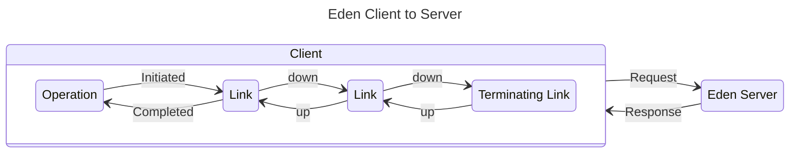

# Elysia documentation

Written by VitePress

## Links

```mermaid
---
title: Eden Client to Server
---
stateDiagram-v2
    direction LR

    Client --> Server : Request
    Server --> Client : Response

    state Client {
        direction LR
        state "Operation" as Op
        state "Link" as link_1
        state "Link" as link_2
        state "Terminating Link" as t_link

        Op --> link_1 : Initiated
        link_1 --> Op : Completed

        link_1 --> link_2 : down
        link_2 --> link_1 : up

        link_2 --> t_link : down
        t_link --> link_2 : up
    }

    state "Eden Server" as Server
```
